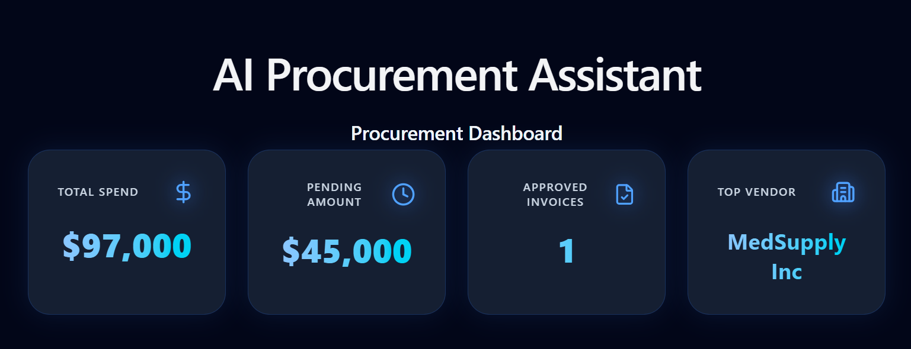
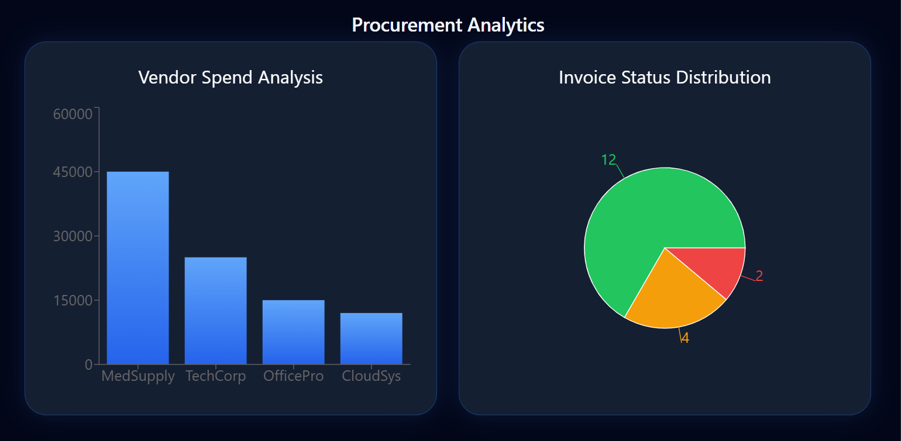
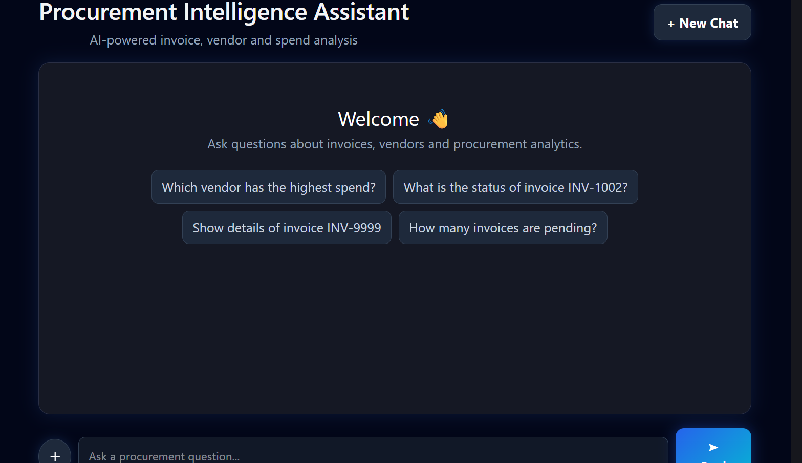
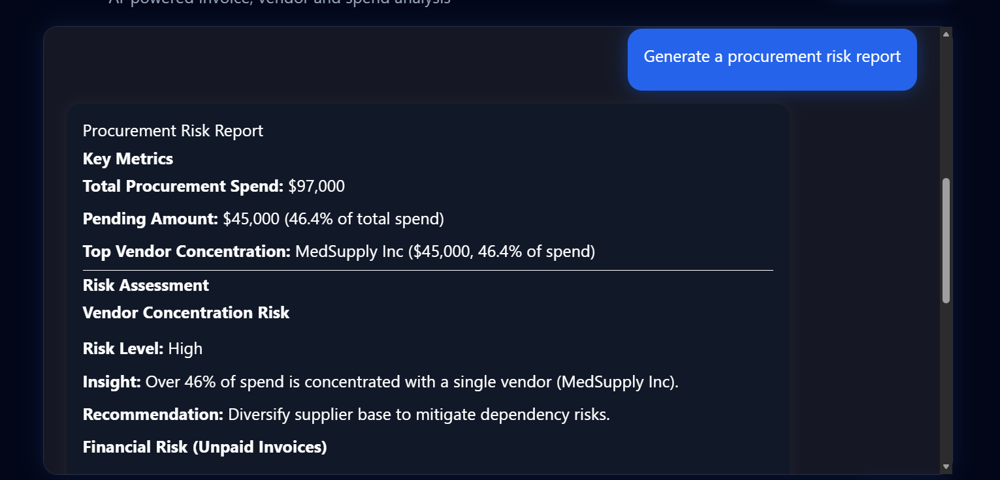

# Enterprise AI Procurement Intelligence Agent

An enterprise-grade multi-agent AI system that automates procurement operations using LangGraph, FastAPI, PostgreSQL, ChromaDB, and Large Language Models.

The platform combines invoice intelligence, procurement analytics, vendor intelligence, approval workflows, procurement risk assessment, and Retrieval-Augmented Generation (RAG) into a single conversational interface.

## Key Highlights

* Multi-Agent Architecture using LangGraph
* Retrieval-Augmented Generation (RAG) over 100+ procurement documents
* Natural Language Invoice Search and Analysis
* Procurement Spend Analytics
* Vendor Intelligence and Spend Tracking
* Procurement Risk Assessment
* Approval Workflow Automation
* Enterprise-Style Conversational Interface
* Fully Deployed Frontend and Backend

---

## Features

### Invoice Intelligence (RAG)

* Query procurement invoices using natural language
* Semantic search across procurement documents
* Business justification extraction
* Invoice summary generation
* Metadata-aware document retrieval

Example:

```text
What is the business justification for invoice INV-1047?
Summarize invoice INV-1001.
Which invoices involve software licenses?
```

---

### Procurement Analytics

* Total procurement spend analysis
* Approved invoice reporting
* Pending payment tracking
* Executive procurement summaries

Example:

```text
What is the total procurement spend?
Generate a procurement summary.
```

---

### Vendor Intelligence

* Top vendor identification
* Vendor spend analysis
* Spend concentration insights
* Supplier dependency analysis

Example:

```text
Who is the top vendor by spend?
How much have we spent with MedSupply Inc?
```

---

### Procurement Risk Assessment

* Vendor concentration risk detection
* Outstanding payment analysis
* Procurement exposure monitoring
* Actionable risk recommendations

Example:

```text
Generate a procurement risk report.
```

---

### Approval Workflow Automation

* Approve invoices using natural language
* Reject invoices using natural language
* Database-backed workflow execution
* Automated status updates

Example:

```text
Approve invoice INV-1002.
Reject invoice INV-1003.
```

---

### Enterprise Guardrails

* Procurement-only assistant behavior
* Out-of-scope query detection
* Missing invoice handling
* Structured business responses

Example:

```text
Tell me about cricket.
```

Response:

```text
I am an Enterprise Procurement Agent and can only assist with procurement-related questions.
```

---

## System Architecture

```text
User
 │
 ▼
React Frontend (Vercel)
 │
 ▼
FastAPI Backend (Railway)
 │
 ▼
LangGraph Workflow
 │
 ├── Intent Agent
 ├── Database Agent
 ├── Analytics Agent
 ├── Vendor Analytics Agent
 ├── Risk Agent
 ├── Approval Agent
 ├── Summary Agent
 ├── RAG Agent
 ├── Out-of-Scope Agent
 └── Response Agent
 │
 ▼
Data Layer
 │
 ├── PostgreSQL (Neon)
 ├── ChromaDB
 └── Procurement PDF Knowledge Base
 │
 ▼
OpenRouter + DeepSeek LLM
```

---

## Tech Stack

### Frontend

* React
* Vite
* Tailwind CSS
* Axios

### Backend

* FastAPI
* LangGraph
* SQLAlchemy

### AI & RAG

* OpenRouter
* DeepSeek Chat V3
* Sentence Transformers
* ChromaDB

### Database

* PostgreSQL (Neon)

### Deployment

* Railway
* Vercel
* Docker

---

## Project Structure

```text
agents/
api/
database/
docs/
frontend/
models/
rag/
scripts/
workflows/

Dockerfile
docker-compose.yml
requirements.txt
```

---

## Example Queries

### Invoice Intelligence

```text
What is the status of invoice INV-1001?
Summarize invoice INV-1047.
What is the business justification for invoice INV-1047?
```

### Analytics

```text
What is the total procurement spend?
Show unpaid invoices.
Generate a procurement summary.
```

### Vendor Intelligence

```text
Who is the top vendor by spend?
How much have we spent with MedSupply Inc?
```

### Risk Assessment

```text
Generate a procurement risk report.
```

### Workflow Automation

```text
Approve invoice INV-1002.
Reject invoice INV-1003.
```

---

## Running Locally

### Backend

```bash
pip install -r requirements.txt
uvicorn api.app:app --reload
```

### Frontend

```bash
cd frontend
npm install
npm run dev
```

---

## Screenshots

### Dashboard



### Procurement Analytics



### Invoice Intelligence



### Risk Assessment



---

## Future Improvements

* User Authentication
* Role-Based Access Control
* Supplier Performance Scoring
* Procurement Forecasting
* Contract Intelligence
* Document Upload Interface
* Real-Time Approval Notifications
* Multi-Tenant Procurement Workspaces

---

## Author

**Ajay Armugam**

B.Tech Graduate | AI/ML Engineer

Built using LangGraph, FastAPI, PostgreSQL, ChromaDB, OpenRouter, and DeepSeek.
